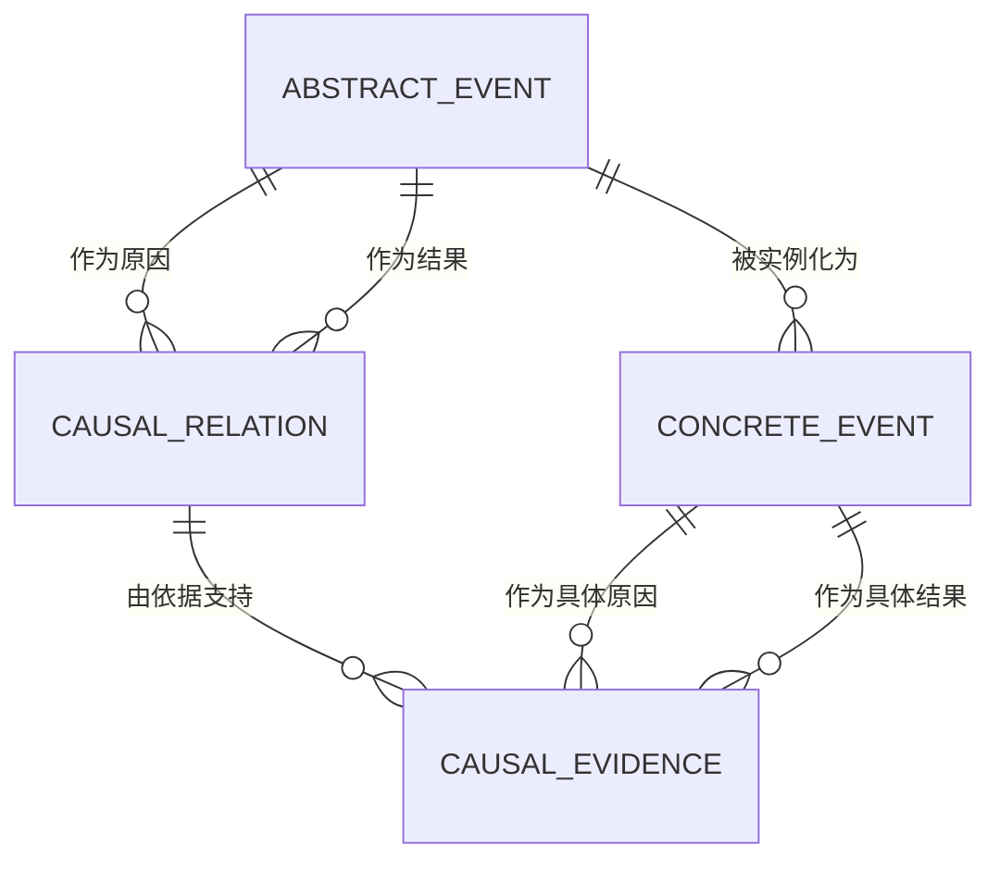

# 因果网络应用设计规范

版本：V1.0  
状态：可进入原型与开发  
日期：2026-07-19

## 1. 产品结论

本应用用于建立一套可追溯的因果知识网络：

- 用户维护“抽象事件”和“抽象因果关系”，它们构成默认展示的因果网络。
- 用户用真实发生过的“具体事件”和“具体因果依据”支持抽象内容。
- 抽象事件与抽象因果关系的置信度由有效依据数量自动计算，不能手工修改。
- 主网络只展示抽象层；具体记录集中在依据库，并可从节点或连线追溯查看。

产品首版只解决四件事：添加事件、添加因果关系、维护具体依据、浏览因果网络。暂不加入 AI 自动推理、多人审批、统计因果推断或复杂权限。

## 2. 核心概念

### 2.1 抽象事件（Event）

从多个真实发生的具体事件中抽象出的、在当前分析粒度下不可再拆分的单一状态变化。

示例：

- 合格：“用户取消订阅”
- 不合格：“用户发现价格上涨并取消订阅”——包含“发现价格上涨”和“取消订阅”两个事件

原子性不是物理意义上的绝对不可分，而是相对于当前产品的分析粒度不可再分。一个抽象事件必须同时满足：

1. 只描述一个主体的一次状态变化。
2. 名称中不包含“并且、然后、导致”等组合或因果表达。
3. 任一具体事件都能明确映射到它，而不需要只取具体事件的一部分。
4. 继续拆分后将失去当前分析价值。

### 2.2 具体事件（Event Occurrence）

在真实时间轴上发生过的一次事件，必须归属于一个抽象事件，并具有发生时间和可核查的依据说明。

示例：“2026 年 7 月 10 日，客户 A 在账单页取消年度订阅。”

### 2.3 抽象因果关系（Causal Relation）

两个抽象事件之间的有方向关联，表达“原因事件的发生会促成结果事件发生”。方向固定为：

`原因事件 → 结果事件`

首版允许反馈环，但不允许同一事件指向自身，也不允许同一方向上出现重复关系。

### 2.4 具体因果依据（Causal Evidence）

一次真实的“具体原因事件促成具体结果事件”的记录。它必须引用两个已经存在的具体事件，并归属于对应的抽象因果关系。

只有满足以下一致性约束时才能保存：

- 具体原因事件归属抽象关系的原因事件。
- 具体结果事件归属抽象关系的结果事件。
- 结果事件时间不早于原因事件时间。
- 同一对具体事件不能重复作为同一关系的依据。

## 3. 产品原则

1. **抽象层与依据层分离**：网络用于理解规律，依据库用于核查规律。
2. **全程可追溯**：每个置信度数字都能下钻到具体记录。
3. **先去重，再新增**：创建事件和关系前必须先搜索相似项。
4. **置信度自动生成**：用户只能增删依据，不能直接编辑分数。
5. **原子性优先于表达完整**：复合叙述应拆成多个事件，再用关系连接。
6. **首版只表达支持强度**：置信度表示累计依据强度，不宣称完成了统计学因果证明。

## 4. 信息架构

桌面端使用左侧导航，移动端折叠为底部或抽屉导航。

1. **因果网络**：默认首页，查看全部抽象事件与关系。
2. **事件**：管理抽象事件，并查看其具体事件。
3. **因果关系**：管理抽象关系，并查看其具体因果依据。
4. **依据库**：统一检索全部具体事件和具体因果依据。

全局右上角只保留两个主操作：

- `添加事件`
- `添加因果关系`

“添加具体事件”和“添加具体依据”作为对应详情页或侧边详情面板中的次级操作，不与两个主操作竞争。

## 5. 核心页面设计

### 5.1 因果网络页

页面采用“顶部工具栏 + 全屏画布 + 右侧详情面板”的结构。

```text
┌──────────────────────────────────────────────────────────────────────┐
│ 搜索事件   置信度筛选   显示孤立节点   重新布局   适应画布    + 添加 │
├───────────────────────────────────────────────┬──────────────────────┤
│                                               │ 选中项详情           │
│             可缩放、可拖动画布                │ 名称 / 定义          │
│                                               │ 置信度 / 依据数       │
│      [事件 A] ━━━━━━━▶ [事件 B]               │ 相邻关系             │
│          └──────────▶ [事件 C]                │ 最近依据             │
│                                               │ 查看完整详情          │
└───────────────────────────────────────────────┴──────────────────────┘
```

节点表达抽象事件：

- 节点标题显示事件名称，最多两行；悬停显示完整定义。
- 节点边框饱和度表示事件置信度，右下角显示具体事件数量。
- 孤立节点默认显示，可通过开关隐藏。

连线表达抽象因果关系：

- 箭头指向结果事件。
- 线宽与不透明度随关系置信度增加。
- 连线中点显示置信度百分比；缩放较小时自动隐藏文字，避免拥挤。
- 选中连线后，高亮两端节点并打开关系详情面板。

交互要求：

- 滚轮缩放、空白处拖动画布、拖动节点、双击节点打开详情。
- 搜索命中后居中并高亮节点。
- 支持按最低置信度、是否有依据筛选。
- 一键“适应画布”和“重新布局”。用户拖动后的坐标按账户保存。
- 网络为空时显示简短说明和“添加第一个事件”按钮。

图组件选用 **Cytoscape.js**。它采用 MIT 许可证，支持交互式网络、图分析、复合节点和可扩展布局，适合本产品的网络浏览场景。默认采用有向层级布局；出现较多反馈环或交叉边时切换为力导向布局。组件信息以 [Cytoscape.js 官方文档](https://js.cytoscape.org/) 为准。

### 5.2 事件列表页

列表列项：事件名称、简短定义、具体事件数、置信度、关联关系数、更新时间。

支持：搜索、按置信度筛选、按更新时间排序、打开详情。默认不加入分类体系，避免首版维护额外层级。

事件详情使用右侧宽面板或独立页，包含：

- 基本信息：名称、定义、创建时间、更新时间。
- 原子性检查结果。
- 置信度与具体事件数量。
- 作为原因的关系列表、作为结果的关系列表。
- 具体事件记录列表与“添加具体事件”操作。

### 5.3 因果关系列表页

列表列项：原因事件、结果事件、关系说明、具体依据数、置信度、更新时间。

关系详情包含：

- `原因事件 → 结果事件` 的方向摘要。
- 关系说明。
- 置信度、有效依据数量和计算说明。
- 具体因果依据列表。
- “添加具体依据”操作。

### 5.4 依据库

依据库包含两个页签：

- **具体事件**：时间、标题、所属抽象事件、依据来源、录入时间。
- **具体因果依据**：具体原因事件、具体结果事件、所属抽象关系、依据说明、录入时间。

依据库只承担检索和核查，不提供新的顶级业务对象。

## 6. 添加流程

### 6.1 添加事件

采用右侧抽屉或聚焦式弹窗，分两步完成。

**步骤 1：定义抽象事件**

字段：

- 事件名称，必填，建议使用“主体 + 原子状态变化”，2–40 字。
- 事件定义，必填，说明什么情况算该事件，20–300 字。

输入名称后即时搜索相似事件；发现高度相似项时优先提示复用，用户确认不同后仍可创建。

提交前执行四项原子性检查：单一主体、单一变化、无组合词、无因果词。自动检查只作提示，最终由用户确认。

**步骤 2：添加首条具体事件（可跳过）**

字段：

- 具体事件标题，必填。
- 发生时间，必填；允许精确时间或时间范围。
- 事件描述，必填。
- 依据，必填；至少提供来源链接、附件或文字出处中的一种。

跳过后，抽象事件以“未验证”状态进入网络，置信度为 0。

### 6.2 添加因果关系

同样分两步完成。

**步骤 1：定义抽象关系**

- 原因事件，必填，可搜索选择。
- 结果事件，必填，可搜索选择。
- 关系说明，必填，说明原因事件如何促成结果事件，20–500 字。

界面始终显示大号方向预览：`原因事件 → 结果事件`。如果反向关系已经存在，应明确提示但允许创建；如果同向关系已存在，则阻止重复创建并引导打开原关系。

**步骤 2：添加首条具体因果依据（可跳过）**

- 具体原因事件，必填，只显示归属于原因事件的记录。
- 具体结果事件，必填，只显示归属于结果事件的记录。
- 因果依据说明，必填，说明为什么不是单纯的时间先后或相关性。
- 依据，必填；至少提供来源链接、附件或文字出处中的一种。

如果所需具体事件尚不存在，允许在当前流程中快速创建，完成后返回原表单。

## 7. 置信度规则

### 7.1 首版计算方式

事件置信度依据其有效具体事件数量；关系置信度依据其有效具体因果依据数量。两者使用同一条饱和增长公式：

```text
confidence = round(100 × (1 - e^(-n / 5)))
```

其中 `n` 为去重后的有效依据数，结果最高显示为 99%，避免把累计支持误读为绝对确定。

参考值：

| 有效依据数 | 置信度 | 展示等级 |
| ---------: | -----: | -------- |
|          0 |     0% | 未验证   |
|          1 |    18% | 初步     |
|          3 |    45% | 初步     |
|          5 |    63% | 中等     |
|         10 |    86% | 较高     |
|         15 |    95% | 很高     |

展示等级仅用于阅读：0% 为“未验证”，1–49% 为“初步”，50–79% 为“中等”，80–94% 为“较高”，95–99% 为“很高”。

### 7.2 计算约束

- 依据新增、删除或失效时立即重算。
- 同一具体事件只能为一个抽象事件计数一次。
- 同一对具体事件只能为同一抽象关系计数一次。
- 首版所有有效依据等权，不引入人工质量打分。
- 分数旁必须显示“基于 N 条依据”，并提供计算说明入口。

该分数只表示应用内累计支持强度。它不能替代实验、反事实分析或统计因果推断。

## 8. 数据模型



### 8.1 `abstract_event`

| 字段                        | 类型        | 规则                   |
| --------------------------- | ----------- | ---------------------- |
| `id`                        | UUID        | 主键                   |
| `name`                      | varchar(40) | 必填；同名规范化后唯一 |
| `definition`                | text        | 必填，20–300 字        |
| `evidence_count`            | integer     | 系统维护               |
| `confidence`                | integer     | 0–99，系统维护         |
| `status`                    | enum        | `active` / `archived`  |
| `created_at` / `updated_at` | timestamp   | 系统维护               |

### 8.2 `concrete_event`

| 字段                        | 类型         | 规则                    |
| --------------------------- | ------------ | ----------------------- |
| `id`                        | UUID         | 主键                    |
| `abstract_event_id`         | UUID         | 必填，外键              |
| `title`                     | varchar(120) | 必填                    |
| `description`               | text         | 必填                    |
| `occurred_at_start`         | timestamp    | 必填                    |
| `occurred_at_end`           | timestamp    | 可空；不得早于开始时间  |
| `source_type`               | enum         | `url` / `file` / `text` |
| `source_value`              | text         | 必填                    |
| `status`                    | enum         | `valid` / `invalid`     |
| `created_at` / `updated_at` | timestamp    | 系统维护                |

### 8.3 `causal_relation`

| 字段                        | 类型      | 规则                         |
| --------------------------- | --------- | ---------------------------- |
| `id`                        | UUID      | 主键                         |
| `cause_event_id`            | UUID      | 必填，外键                   |
| `effect_event_id`           | UUID      | 必填，外键；不得等于原因事件 |
| `description`               | text      | 必填，20–500 字              |
| `evidence_count`            | integer   | 系统维护                     |
| `confidence`                | integer   | 0–99，系统维护               |
| `status`                    | enum      | `active` / `archived`        |
| `created_at` / `updated_at` | timestamp | 系统维护                     |

唯一约束：`(cause_event_id, effect_event_id)`。

### 8.4 `causal_evidence`

| 字段                        | 类型      | 规则                    |
| --------------------------- | --------- | ----------------------- |
| `id`                        | UUID      | 主键                    |
| `causal_relation_id`        | UUID      | 必填，外键              |
| `cause_occurrence_id`       | UUID      | 必填，外键              |
| `effect_occurrence_id`      | UUID      | 必填，外键              |
| `explanation`               | text      | 必填                    |
| `source_type`               | enum      | `url` / `file` / `text` |
| `source_value`              | text      | 必填                    |
| `status`                    | enum      | `valid` / `invalid`     |
| `created_at` / `updated_at` | timestamp | 系统维护                |

唯一约束：`(causal_relation_id, cause_occurrence_id, effect_occurrence_id)`。

## 9. 视觉与交互规范

### 9.1 视觉方向

整体采用专业、克制的知识工具风格：浅灰背景、白色内容面板、深色正文、单一蓝紫强调色。避免大面积渐变、拟物阴影和装饰性图标。

建议色值：

- 页面背景：`#F6F7F9`
- 面板：`#FFFFFF`
- 主文字：`#172033`
- 次文字：`#667085`
- 主色：`#5B5BD6`
- 成功/高置信：`#168B72`
- 警示/低置信：`#D97706`
- 边框：`#E4E7EC`

### 9.2 组件与密度

- 圆角：卡片 12px，输入框与按钮 8px。
- 阴影：仅浮层和右侧面板使用轻阴影。
- 字体：系统无衬线字体栈；正文 14px，列表主信息 14–15px，页面标题 24px。
- 常用间距基于 4px 网格；表单字段间距 16px，区块间距 24px。
- 主按钮每个视图不超过一个；危险操作使用文字按钮并二次确认。

### 9.3 反馈与状态

- 保存成功后就地更新，不整页刷新，并显示短暂提示。
- 网络重新布局期间保留旧图并显示顶部进度条，避免画布闪空。
- 删除抽象事件或关系前，如果仍有关联依据则禁止硬删除，只允许归档。
- 表单错误显示在对应字段下，不只使用全局提示。
- 所有置信度颜色同时配合文字或数值，不能只依赖颜色传达。

### 9.4 响应式

- 主要面向宽度不低于 1024px 的桌面使用。
- 768–1023px：侧栏折叠为图标，详情面板覆盖画布。
- 小于 768px：支持列表和详情操作；网络图可浏览，但不承诺复杂编辑体验。

## 10. 建议技术边界

首版建议采用以下简单架构：

- 前端：React + TypeScript。
- 图可视化：Cytoscape.js。
- 后端：常规 REST API；事件、关系和依据均采用事务写入。
- 数据库：PostgreSQL，使用外键和唯一约束保证映射一致性。
- 附件：对象存储；数据库只保存文件元数据和地址。

不要求首版引入图数据库。当前查询主要是列表、详情、相邻关系和全图读取，关系型数据库足以满足；未来只有在大规模多跳路径分析成为核心功能时再评估图数据库。

## 11. 关键业务规则

1. 归档抽象事件后，它及其相关关系默认不在网络显示，但历史依据保留。
2. 不能把已被因果依据引用的具体事件直接删除；应标记为失效并自动重算置信度。
3. 编辑具体事件的归属前，必须先检查是否会破坏既有因果依据映射。
4. 反向关系是独立关系，`A → B` 与 `B → A` 可以同时存在。
5. 网络允许形成环，不能以“检测到环”为由阻止保存。
6. 所有列表、详情和网络使用同一份置信度数据，避免展示不一致。

## 12. MVP 验收标准

- 能创建、编辑、归档抽象事件，并执行原子性提示与相似项提示。
- 能为抽象事件添加具体事件，且置信度即时更新。
- 能创建、编辑、归档有方向的抽象因果关系，并阻止同向重复关系。
- 能用两个匹配的具体事件创建具体因果依据，且关系置信度即时更新。
- 能在依据库检索具体事件和具体因果依据，并从抽象对象追溯到全部依据。
- 能在网络中查看全部有效抽象事件和关系，完成缩放、拖动、搜索、筛选、选中和重新布局。
- 节点和连线能明确展示方向、置信度和依据数量。
- 归档、失效或删除依据后，网络和详情中的置信度保持一致。
- 桌面端键盘可操作主要表单，文字与背景对比度满足 WCAG AA 的基本要求。

## 13. 首版明确不做

- AI 自动拆分事件、自动发现关系或自动判断因果。
- 统计学因果推断、反事实模拟和实验设计。
- 多人审批、角色权限、评论和通知。
- 标签体系、事件本体继承、复杂条件关系和多原因组合关系。
- 大规模数据导入、公开分享、报表中心和移动端完整编辑。

## 14. 已采用的产品假设

- 一个具体事件在首版只归属于一个抽象事件。
- 一条抽象关系只连接一个原因事件和一个结果事件。
- 具体记录由用户录入并对其真实性负责，系统只校验结构一致性。
- 置信度只基于去重后的有效支持依据，不处理反例和来源质量差异。
- “原子事件”的边界由当前分析目标决定，自动规则只提示，不代替人的判断。

如果后续需要引入反例、证据质量权重或复合原因，必须先升级置信度模型和数据结构，不能直接叠加到当前分数上。
