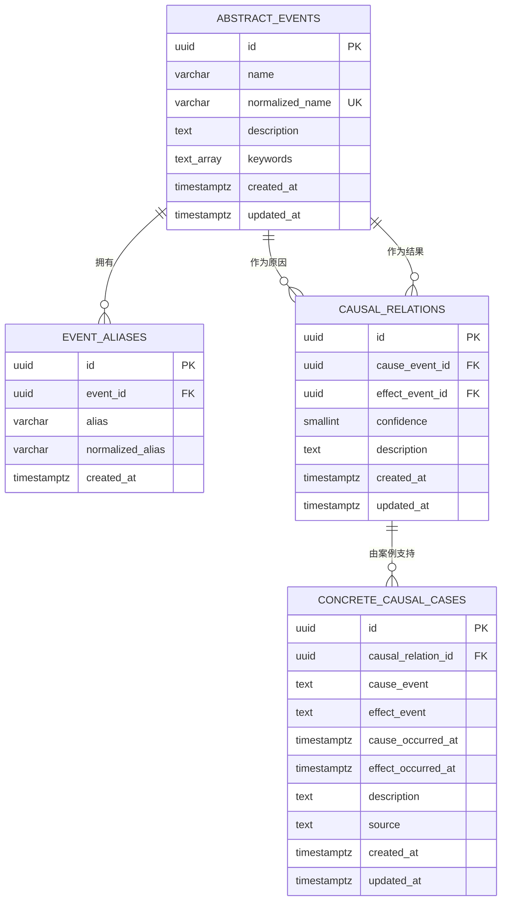

# P1-02 核心数据模型、迁移与测试数据工具设计

版本：V1.0  
日期：2026-07-20  
状态：已完成
所属路线图步骤：P1-02 核心数据模型、迁移与测试数据工具  
前置步骤：P1-01 已完成人工验收并提交

> 后续模型变更：P1-05 根据最新确认需求，将具体案例调整为独立实体，并通过多对多关联支持抽象因果关系。本文中的具体案例一对多模型仅记录 P1-02 当时的已实现状态，P1-05 及后续开发以 `P1-05-concrete-case-management-design.md` 为准。

## 1. 目标

为第一阶段三个核心业务对象建立可执行、可迁移、可验证的 PostgreSQL 数据模型：

1. 抽象原子事件；
2. 抽象因果关系；
3. 绑定抽象关系的具体因果案例。

本步骤完成后，项目必须能够从空 PostgreSQL 数据库执行迁移，重复装载固定种子数据，并按指定规模生成后续开发所需的模拟数据。

## 2. 非目标

本步骤不实现：

- 事件、关系或案例 REST CRUD 接口；
- 事件、关系或案例管理页面；
- 局部因果图查询和展示；
- 自动置信度计算；
- 根据案例数量修改置信度；
- 条件化关系、反例、不确定案例或附件；
- AI、语义搜索、向量数据库或独立搜索服务；
- 软删除、恢复、修改历史和审计记录；
- 清空开发数据库的快捷命令。

事件是否满足“逻辑原子事件”仍由用户判断，数据库只保证结构、引用和唯一性，不能自动判断语义原子性。

## 3. 建模方案选择

### 3.1 采用方案

采用“具体因果案例直接绑定抽象关系”的单层案例模型：

```text
抽象原因事件 ── 抽象因果关系 ──> 抽象结果事件
                         │
                         └── 具体因果案例
                             ├── 具体原因
                             ├── 具体结果
                             ├── 原因发生时间
                             ├── 结果发生时间
                             ├── 说明
                             └── 来源
```

一个案例自身就是一次真实发生的“具体原因导致具体结果”记录。它不拆成两个可独立复用的具体事件，也不作为因果图节点。

### 3.2 未采用方案

- 不建立旧设计中的 `concrete_event + causal_evidence` 两层模型，因为它会使具体事件重新归属于单个抽象事件，与最新确认逻辑冲突。
- 不使用 JSONB 保存整个案例，因为会削弱必填字段、时间顺序、外键和索引约束。
- 不使用 Neo4j。第一阶段的局部图可以由 PostgreSQL 的关系表查询得到。

## 4. 技术范围

P1-02 新增以下锁定依赖：

| 依赖 | 版本 | 用途 |
|---|---:|---|
| `drizzle-orm` | 0.45.2 | 类型化 Schema 和数据库访问 |
| `drizzle-kit` | 0.31.10 | 生成和管理 SQL 迁移 |
| `@fastify/swagger` | 9.8.1 | 建立后续 REST API 的 OpenAPI 生成约定 |

继续使用：

- PostgreSQL 18.4；
- `pg` 8.22.0；
- Zod 4.4.3；
- Testcontainers 12.0.4；
- Vitest 4.1.10。

本步骤不增加第二种 ORM、数据库驱动、迁移工具或数据生成框架。

## 5. 数据关系



## 6. 表结构

所有表名和字段名使用 `snake_case`。所有主键使用 UUID，默认由 PostgreSQL `gen_random_uuid()` 生成。所有业务时间使用 `timestamptz` 并按 UTC 保存；后续 API 统一输出 ISO 8601。

### 6.1 `abstract_events`

| 字段 | PostgreSQL 类型 | 空值 | 规则 |
|---|---|---|---|
| `id` | `uuid` | 否 | 主键，默认 `gen_random_uuid()` |
| `name` | `varchar(120)` | 否 | 去除首尾空白后长度为 1–120 |
| `normalized_name` | `varchar(120)` | 否 | 数据库生成：`lower(btrim(name))` |
| `description` | `text` | 是 | 可选的事件定义；非空时去除首尾空白后不得为空 |
| `keywords` | `text[]` | 否 | 默认空数组；供 P1-03 传统搜索使用 |
| `created_at` | `timestamptz` | 否 | 默认当前时间 |
| `updated_at` | `timestamptz` | 否 | 默认当前时间；后续写操作显式更新 |

约束和索引：

- `normalized_name` 全局唯一；
- `name` 不允许只包含空白；
- `normalized_name` 普通 B-tree 唯一索引同时支持精确候选查询；
- P1-02 不增加全文检索索引，P1-03 根据真实查询设计补充。

名称规范化只执行去除首尾空白和大小写归一，不擅自删除名称内部空格、标点或中文字符。

### 6.2 `event_aliases`

| 字段 | PostgreSQL 类型 | 空值 | 规则 |
|---|---|---|---|
| `id` | `uuid` | 否 | 主键，默认 `gen_random_uuid()` |
| `event_id` | `uuid` | 否 | 外键指向 `abstract_events.id` |
| `alias` | `varchar(120)` | 否 | 去除首尾空白后长度为 1–120 |
| `normalized_alias` | `varchar(120)` | 否 | 数据库生成：`lower(btrim(alias))` |
| `created_at` | `timestamptz` | 否 | 默认当前时间 |

约束和索引：

- 同一事件下的 `normalized_alias` 唯一；
- 不禁止不同事件使用相同别名，搜索时允许返回多个候选事件；
- `event_id` 建立索引；
- `normalized_alias` 建立索引；
- 删除一个尚未被关系引用的事件时，其别名随事件级联删除。

数据库不建立跨表的“别名不得等于任何事件标准名称”约束。P1-03 的创建界面可以提示冲突，但不应因此阻止两个真实不同事件的录入。

### 6.3 `causal_relations`

| 字段 | PostgreSQL 类型 | 空值 | 规则 |
|---|---|---|---|
| `id` | `uuid` | 否 | 主键，默认 `gen_random_uuid()` |
| `cause_event_id` | `uuid` | 否 | 外键指向原因事件 |
| `effect_event_id` | `uuid` | 否 | 外键指向结果事件 |
| `confidence` | `smallint` | 否 | 用户人工置信度，整数 0–100，无数据库默认值 |
| `description` | `text` | 是 | 可选的关系说明；非空时不得只包含空白 |
| `created_at` | `timestamptz` | 否 | 默认当前时间 |
| `updated_at` | `timestamptz` | 否 | 默认当前时间；后续写操作显式更新 |

约束和索引：

- `cause_event_id <> effect_event_id`，禁止自环；
- `(cause_event_id, effect_event_id)` 唯一，禁止同向重复；
- 允许 `(A, B)` 和 `(B, A)` 同时存在；
- `confidence` 必须在 0–100 之间；
- 原因和结果外键均使用 `ON DELETE RESTRICT`；
- `cause_event_id`、`effect_event_id` 分别建立索引，供上游和下游查询使用。

置信度只由用户在 P1-04 创建或修改。具体案例数量不触发置信度变化。

### 6.4 `concrete_causal_cases`

| 字段 | PostgreSQL 类型 | 空值 | 规则 |
|---|---|---|---|
| `id` | `uuid` | 否 | 主键，默认 `gen_random_uuid()` |
| `causal_relation_id` | `uuid` | 否 | 外键指向被支持的抽象因果关系 |
| `cause_event` | `text` | 否 | 本案例中真实发生的具体原因，去除空白后不得为空 |
| `effect_event` | `text` | 否 | 本案例中真实发生的具体结果，去除空白后不得为空 |
| `cause_occurred_at` | `timestamptz` | 否 | 具体原因发生时间 |
| `effect_occurred_at` | `timestamptz` | 否 | 具体结果发生时间 |
| `description` | `text` | 否 | 对因果关联的人工说明，去除空白后不得为空 |
| `source` | `text` | 否 | URL、公开资料名称或文字出处；不得只包含空白 |
| `created_at` | `timestamptz` | 否 | 默认当前时间 |
| `updated_at` | `timestamptz` | 否 | 默认当前时间；后续写操作显式更新 |

约束和索引：

- `effect_occurred_at >= cause_occurred_at`；
- 案例必须绑定一条已存在的抽象关系；
- 关系外键使用 `ON DELETE RESTRICT`，避免删除关系时连带丢失案例；
- `causal_relation_id` 建立索引；
- `(causal_relation_id, effect_occurred_at desc)` 建立组合索引，支持关系详情按时间读取案例。

首版不为案例建立自动去重唯一键。真实案例可能拥有相同日期和相似描述，强制组合唯一键可能误伤有效记录；P1-05 通过页面展示和人工判断避免重复。

## 7. 派生数据规则

### 7.1 案例数量

`causal_relations` 不保存可漂移的 `case_count` 列。案例数量由以下逻辑派生：

```sql
count(concrete_causal_cases.id)
```

P1-04 在案例功能尚未实现时返回 `0` 占位；P1-05 和 P1-06 通过分组查询返回真实数量。首版局部图最多 100 个节点，可在建立关系外键索引后稳定完成聚合。

### 7.2 置信度

- `confidence` 只存在于 `causal_relations`；
- 抽象事件不设置置信度；
- 案例不设置单独置信度或权重；
- 增删案例不得自动修改关系置信度；
- 首版不记录置信度修改历史，历史功能属于 P2-01。

## 8. 删除和引用规则

P1-02 只建立数据库保护，不提供删除 API：

- 删除事件时，如果它仍作为任一关系的原因或结果，数据库拒绝删除；
- 删除关系时，如果它仍有具体案例，数据库拒绝删除；
- 删除事件且没有关系引用时，所属别名级联删除；
- 删除单条别名不会影响事件；
- 删除单条具体案例不会影响关系置信度；
- 软删除、恢复和引用影响预览统一留到 P2-01。

## 9. Drizzle Schema 和迁移

### 9.1 文件职责

```text
apps/api/
├── drizzle.config.ts
└── src/database/
    ├── client.ts                    # 使用现有 pg Pool 创建 Drizzle 实例
    ├── migrate.ts                   # 执行已提交迁移
    ├── verify.ts                    # 只读输出表和记录数量
    ├── schema/
    │   ├── abstractEvents.ts
    │   ├── eventAliases.ts
    │   ├── causalRelations.ts
    │   ├── concreteCausalCases.ts
    │   └── index.ts
    └── test-data/
        ├── fixedSeed.ts             # 小型固定数据
        ├── simulate.ts              # 参数校验和生成入口
        └── simulatedData.ts         # 确定性数据构造

database/
└── migrations/
    ├── 0000_core_model.sql
    └── meta/                        # Drizzle 迁移元数据
```

业务 Schema 归属 API，因为 API 是唯一允许访问 PostgreSQL 的应用。生成的 SQL 迁移放在仓库根目录，便于测试、容器化和未来部署统一执行。

### 9.2 迁移规则

- Schema 变更先修改 Drizzle Schema，再生成 SQL 迁移；
- 生成的 SQL 和 `meta` 文件必须提交 Git；
- 开发和部署只执行已提交迁移，不使用 `drizzle-kit push` 修改正式结构；
- `db:migrate` 可以重复执行，已应用迁移不会再次执行；
- 从空数据库执行和从已有迁移状态继续执行都必须成功；
- 迁移失败必须返回非零退出码，不打印完整 `DATABASE_URL`；
- P1-02 只有一个初始核心模型迁移，不创建演示业务表或视图。

## 10. 数据工具

### 10.1 根命令

新增以下根命令：

```text
pnpm db:generate       # 根据 Schema 生成待审核 SQL 迁移
pnpm db:migrate        # 执行已提交迁移
pnpm db:seed           # 装载固定种子数据
pnpm db:simulate -- ...# 追加一批可配置模拟数据
pnpm db:verify         # 只读检查迁移状态和各表数量
```

`db:generate` 是开发命令，不在应用启动时自动运行。`db:migrate` 不自动执行种子或模拟数据。

### 10.2 固定种子数据

固定种子包含一组规模小、方向清楚的金融因果链：

- 12 个抽象事件；
- 每个事件 0–2 个别名和少量关键词；
- 15 条抽象因果关系；
- 18 条具体因果案例；
- 至少包含一处分支、一处汇合和一对允许存在的反向关系；
- 置信度覆盖 0、低、中、高四种显示场景。

固定数据使用稳定 UUID。`pnpm db:seed` 在一个事务内执行并采用幂等写入；重复执行不会增加记录数量，也不会覆盖用户在后续页面中修改的数据。

### 10.3 可配置模拟数据

命令示例：

```bash
pnpm db:simulate -- --events=1000 --relations=3000 --cases=10000 --seed=42
```

参数：

| 参数 | 默认值 | 有效范围 | 含义 |
|---|---:|---:|---|
| `--events` | 1000 | 2–100000 | 本批新增事件数量 |
| `--relations` | 3000 | 1–500000 | 本批新增关系数量 |
| `--cases` | 10000 | 0–1000000 | 本批新增案例数量 |
| `--seed` | 20260720 | 32 位整数 | 控制生成内容和连边选择 |

生成规则：

- 生成批次使用唯一批次标识，避免与固定数据和已有模拟数据重名；
- 同一个批次内事件名称唯一；
- 不生成自环或同向重复关系；
- 允许自然形成分支、汇合、反向关系和循环；
- 每条案例绑定本批或固定数据中的一条有效关系；
- 案例结果时间不得早于原因时间；
- 置信度生成在 0–100 之间，和案例数量无计算关系；
- 使用分批插入和数据库事务，任一批次失败时不保留半批数据；
- 完成后只输出批次标识、耗时和各表新增数量，不输出连接字符串。

如果关系数量超过当前事件可形成的最大有向非自环组合数，命令在写入前失败并显示可理解的参数错误。

### 10.4 数据检查

`pnpm db:verify` 是只读命令，输出：

- 数据库是否可连接；
- 初始迁移是否已应用；
- 四张业务表的记录数量；
- 是否存在自环、越界置信度、失效外键或结果时间早于原因时间的记录。

验证成功退出码为 0；结构缺失或完整性检查失败退出码为 1。输出不包含数据库密码和完整连接字符串。

## 11. OpenAPI 基础约定

P1-01 设计约定在 P1-02 引入 Swagger。本步骤只完成最小基础，不增加业务 CRUD：

- Fastify 注册 `@fastify/swagger`；
- 现有健康和就绪路由补充请求/响应 Schema；
- 新增 `GET /api/openapi.json` 返回生成的 OpenAPI JSON；
- OpenAPI 标题为 `Causality API`，版本为 `0.1.0`；
- 不安装 Swagger UI，不增加可视化文档页面；
- P1-03 起新增的业务 REST API 必须进入同一文档。

## 12. 配置和安全

- 数据库命令继续使用 `DATABASE_URL`，缺失时立即失败；
- 不为迁移、种子或模拟数据设置隐藏默认数据库地址；
- `.env.example` 保留本地开发示例，真实 `.env` 不进入 Git；
- 日志和异常不得输出完整 `DATABASE_URL`、数据库密码或驱动堆栈给浏览器；
- 数据生成工具不接受任意 SQL、表名或文件路径参数；
- 本步骤不新增清库、删除迁移或回滚全部数据命令。

## 13. 错误处理

### 13.1 迁移

- 数据库不可访问：非零退出并显示“数据库不可连接”；
- 迁移 SQL 失败：停止后续迁移并保留 Drizzle 的迁移状态一致性；
- Schema 和迁移不一致：由集成测试失败暴露，不自动修改数据库。

### 13.2 固定种子

- 未迁移：明确提示先运行 `pnpm db:migrate`；
- 任一固定记录违反约束：整个事务回滚；
- 重复执行：成功退出且记录数量不变。

### 13.3 模拟数据

- 参数不是整数或超出范围：写入前失败；
- 关系数量不可能满足唯一性：写入前失败；
- 中途数据库错误：当前生成事务回滚；
- 失败输出不包含已经生成的大量记录内容。

## 14. 自动化测试设计

### 14.1 Schema 单元测试

- 模拟数据参数默认值和合法边界正确；
- 非整数、负数、超上限和不可能的关系数量校验失败；
- 相同随机种子生成相同的事件内容和连边选择；
- 生成器不产生自环或同向重复关系；
- 生成案例满足时间顺序。

### 14.2 PostgreSQL 集成测试

每组数据库集成测试使用独立 Testcontainers PostgreSQL 18.4：

1. 空数据库可以执行初始迁移；
2. 第二次执行迁移不重复修改结构；
3. 四张业务表和预期索引存在；
4. 规范化后重复事件名称被拒绝；
5. 同一事件的重复别名被拒绝；
6. 关系自环被拒绝；
7. 同向重复关系被拒绝；
8. 反向关系可以独立插入；
9. 0 和 100 置信度可插入，-1 和 101 被拒绝；
10. 不存在的事件外键和关系外键被拒绝；
11. 结果时间早于原因时间被拒绝；
12. 有关系引用的事件不能删除；
13. 有案例引用的关系不能删除；
14. 删除无关系引用的事件会删除其别名；
15. 固定种子执行两次后数量仍为 12、15、18；
16. 小规模模拟数据生成后的记录数量和完整性正确。

测试结束必须关闭连接池并释放容器。

### 14.3 OpenAPI 回归测试

- `/api/openapi.json` 返回 200 和有效 OpenAPI 对象；
- 文档包含 `/api/health` 与 `/api/ready`；
- 健康和就绪接口原有响应保持不变；
- 内部数据库错误不出现在 OpenAPI 响应或客户端错误中。

### 14.4 全量质量门禁

实现完成后执行：

```text
pnpm lint
pnpm format:check
pnpm typecheck
pnpm test
pnpm test:integration
pnpm test:e2e
pnpm build
```

P1-02 没有新页面，但 API 启动流程和依赖发生变化，因此保留现有 Playwright 冒烟测试作为回归门禁。

## 15. 自动化完成标准

- 所有迁移和数据库约束集成测试通过；
- 固定种子幂等测试通过；
- 模拟数据参数和完整性测试通过；
- OpenAPI 回归测试通过；
- 现有 P1-01 单元、组件、集成和浏览器测试没有回归；
- lint、格式、类型检查和构建命令退出码为 0；
- 没有跳过关键数据库测试；
- 日志、API 和测试输出没有敏感连接信息。

## 16. 人工复核清单

自动化测试通过后，用户按以下步骤验收：

1. 启动 PostgreSQL：`docker compose up -d --wait postgres`。
2. 执行 `pnpm db:migrate`，确认迁移成功。
3. 再次执行 `pnpm db:migrate`，确认没有重复建表或错误。
4. 执行 `pnpm db:seed` 两次。
5. 执行 `pnpm db:verify`，确认固定数量为 12 个事件、15 条关系、18 条案例。
6. 执行 `pnpm db:simulate -- --events=1000 --relations=3000 --cases=10000 --seed=42`。
7. 再次执行 `pnpm db:verify`，确认数量增加且完整性检查通过。
8. 启动 API 后访问 `/api/openapi.json`，确认健康和就绪接口存在。
9. 检查终端没有输出数据库密码或完整连接字符串。

本步骤没有 Web 业务页面，不进行新增页面的视觉验收。现有系统状态页只做回归检查。

只有用户明确确认以上人工复核通过，P1-02 才可标记为完成。

## 17. 预计创建和修改的文件

### 17.1 创建

- `apps/api/drizzle.config.ts`；
- `apps/api/src/database/client.ts`；
- `apps/api/src/database/migrate.ts`；
- `apps/api/src/database/verify.ts`；
- `apps/api/src/database/schema/abstractEvents.ts`；
- `apps/api/src/database/schema/eventAliases.ts`；
- `apps/api/src/database/schema/causalRelations.ts`；
- `apps/api/src/database/schema/concreteCausalCases.ts`；
- `apps/api/src/database/schema/index.ts`；
- `apps/api/src/database/test-data/fixedSeed.ts`；
- `apps/api/src/database/test-data/simulate.ts`；
- `apps/api/src/database/test-data/simulatedData.ts`；
- `database/migrations/0000_core_model.sql` 和 Drizzle 元数据；
- 数据模型、迁移、种子、模拟数据和 OpenAPI 测试文件。

### 17.2 修改

- 根 `package.json`：增加数据库命令；
- `apps/api/package.json`：增加 Drizzle 和 Swagger 依赖及数据库脚本；
- `apps/api/src/app.ts`：注册最小 OpenAPI 基础；
- `apps/api/src/routes/health.ts` 和 `readiness.ts`：补充路由 Schema；
- `apps/api/src/database/pool.ts`：与 Drizzle 客户端共享连接池；
- `README.md`：增加迁移和测试数据命令；
- 总体路线图：更新执行状态、当前步骤和 P1-02 状态；
- 本设计文档：根据审核意见更新。

### 17.3 不修改

- Web 页面和样式；
- 因果图代码；
- P1-03 至 P1-10 尚未开始的业务模块；
- 历史设计和工具调研文档。

## 18. 审核重点

请重点确认：

1. 具体因果案例是否应分别保存原因发生时间和结果发生时间；
2. 人工置信度是否采用整数 0–100；
3. 不在关系表冗余保存案例数量是否符合预期；
4. 不同事件允许使用相同别名是否可接受；
5. 固定种子规模和模拟数据默认规模是否适合本地开发；
6. P1-02 是否只完成数据基础，没有提前实现 CRUD 或图查询。
